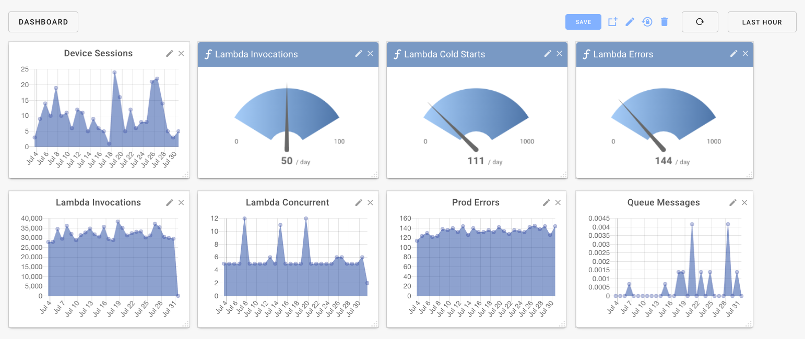

# Ioto Device Clouds

Device clouds are management hubs from which you can centrally operate and manage a set or fleet of devices.

Device Clouds are created in your AWS account and region to manage the day-to-day communications and management with your devices.

{.screen}

A device cloud stores device data and manages communications with your devices. By aggregating critical device data in one place, you can more easily manage your devices and extract important data analytics and intelligence from your device pool.

When creating device clouds, the Builder will create the necessary AWS resources including a DynamoDB device database and service Lambda function in your AWS account.

You can create one or more device clouds to segment your products and devices.

## Data Privacy

The Device Cloud is created in your AWS account so you have total control and privacy regarding your device data. Device data goes directly from your devices to the Device Cloud in your account. The device data is not sent through EmbedThis servers or other AWS accounts. This is important as governments are increasingly requiring that data only be stored, processed and managed locally.

Unlike other IoT services which store your device data in servers in their account, Ioto provides decreased latency by locating device data in your AWS account in a nearby region of your choosing. This lowers cost and boosts performance of your cloud-based management solution.

## Device Cloud Services

The Ioto device cloud offers the following:

* Automatically provision Ioto-based devices with X.509 certificates for secure communications.
* Setup MQTT communications between devices and the cloud.
* Create and maintain a cloud-based device database store for centralized management and analytics.
* Transparently create and manage dedicated AWS IAM access keys for each device.

## Device Certificates

Devices require X.509 certificates to securely connect and communicate with the cloud. The certificates are used to uniquely identify and authenticated devices and then to encrypt communications to prevent tampering or eavesdropping.

Ioto will automatically create and distribute the required certificates as devices are assigned to a device cloud. This eliminates much of the pain of certificate distribution.

## Device Messaging

During device provisioning, the Ioto service will setup the necessary AWS resources to enable secure efficient messaging via AWS IoT core using the MQTT protocol.

MQTT is a messaging protocol for IoT. It is a lightweight publish/subscribe messaging transport that is ideal for connecting remote devices.

When connected, your management applications can control devices, send commands and retrieve data using the MQTT messaging service.

## Device Data Aggregation

Collecting, aggregating and sending device data to a central management store can be complex and costly. Ioto takes the pain out of exporting device data to the cloud by transparently synchronizing device data with the cloud.

Device data written saved the device to the Ioto database will be transparently exported to the cloud. Similarly, data written to the cloud database will be distributed to appropriate devices as required. No programming is required.

The database synchronization is full-duplex in that data can be modified in the device or in the cloud and it will be replicated to the other side. The synchronization is controllable on a per-device and per-table basis.

This is similar to AWS Global Tables, but instead of acting inside AWS between AWS regions, it is between an AWS region and a device.

The Ioto replicated device database is unique to Ioto and dramatically simplifies the creation of IoT solutions.

## Device Access Keys

Ioto can optionally create and manage AWS IAM access keys for your devices. AWS uses IAM access keys to authenticate and authorize actors on AWS resources. The Ioto device cloud can create specific IAM keys to enable devices to issue requests to the device cloud and AWS services.

Ioto generates temporary IAM access keys that have tightly controlled access permissions. The keys are automatically distributed to devices and reissued as required.

## Device Logging

If required, device logs and files can be captured and sent to AWS CloudWatch logs for storage, analysis and governance.

The Ioto agent can be configured without coding, to capture any O/S log or program output and send it to CloudWatch Logs. The Ioto agent log is similarly exportable.

## Device Metrics and Analytics

AWS provides a comprehensive metric service via CloudWatch Metrics. The Ioto agent can emit metrics that will be captured by the device cloud and managed by CloudWatch.

Using these metrics, you can create detailed device analytics and dashboards to focus on any aspect of your device or fleet performance.

## Account Audit

When your device cloud is created, Ioto configures and enables CloudTrail which captures and audit trail of **all** activity on your account and device cloud.  This records a complete record to AWS S3 so you can reliably audit operations and determine root cause of any security incidents.
