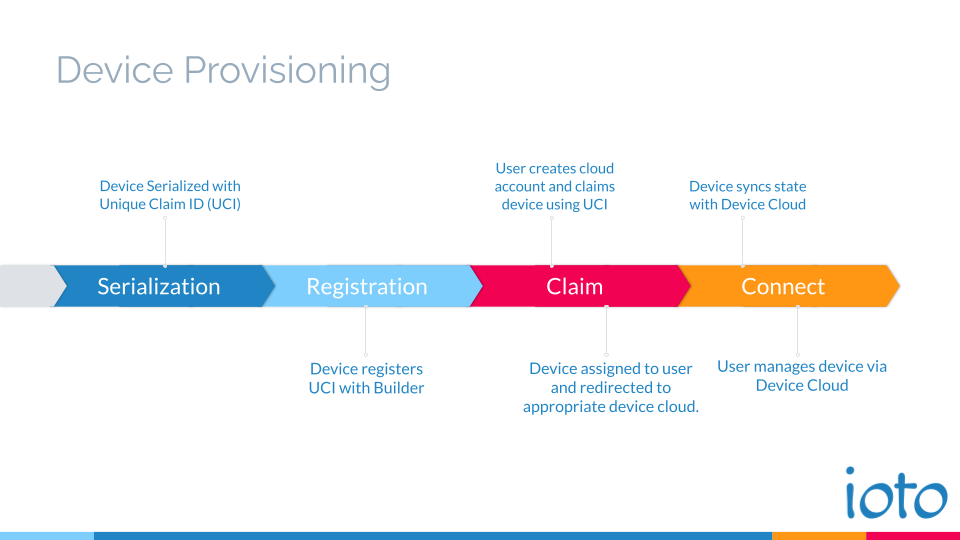
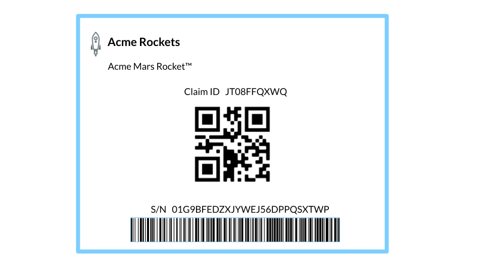

# Provisioning

Provisioning is the process of providing devices with the necessary certificates and credentials to securely connect with cloud-based services.

For devices to securely connect to the cloud, they require X.509 certificates so that they can be uniquely identified and authenticated by the cloud service. Once authorized, the certificates are used by the TLS protocol to securely encrypt all communications.

## Ioto Provisioning

Ioto has an automated provisioning process that takes the pain out of device provisioning and certificate distribution for the user.

Ioto provisioning is accomplished in several phases during the device lifecycle.

* Device Serialization
* Device Registration
* Device Claiming
* Device Connection

{.screen}

## Device Serialization

For secure operation it is essential that each device can be uniquely identified. Most devices are created with a serial number that may include the product code, manufacturing batch number and individual serial number. However, while this serial number may be unique, it can be easily guessed because serial numbers typically follow a predictable format.

Instead of using the existing serial number, Ioto uses a random, unique claim ID (UCI) that is a random, 80-bit number that is not guessable and does not follow a predictable pattern. When paired with the product ID it is used as a unique claim ticket for users to claim devices for management.

```
JT08FFQXWQ
```

The 10 letter UCI results in over 1 quadrillion numbers (32^10).

During manufacturer, each device is given a UCI that identifies the device to the service and is used by the user to "claim" the device after purchase or installation.

The UCI should be printed on the device label and be clearly identified as the **Claim ID**. The Claim ID can also be represented as a QR code if you choose to develop a mobile app for users to claim devices. (See [Claiming](#device-claiming) below).



### Creating the UCI

You have two alternatives when creating the UCI depending on how you operate your production process. Regardless of which method you choose, the end result is the Ioto **device.json5** configuration file is updated with the UCI in the **id** property.

```javascript
{
    "id": "JT08FFQXWQ",
    "product": "01G8YJKKRNTHW213TRZYX3YH0M"
}
```

The **product** property in the device.json5 is generated by the [Builder Site](https://admin.embedthis.com/) when you define your product.

The two options to create the UCI are:

* Create unique firmware for each device
* Dynamically provision the UCI in each device

#### Unique Firmware

If you create unique firmware for each device, you can set the UCI in the **device.json5** when you create the firmware.

To create the UCI, you can either run the **ioto** process with the **--id** argument or you can create a simple program that calls the **cryptID** API from the libioto library. See the **./factory/serialize.c** sample for an example.

#### Dynamic UCI

If you are using identical firmware for each device, you can provision the UCI by having the Ioto agent in your device, connect to a serialization service during manufacturer. The serialization service will generate and provide the UCI to the agent that will then persist it to the **device.json5** configuration file.

This generation should be integrated with your label creation process in manufacturer so that the UCI in the device.json5 matches that product label for the device.

The serialization service should listen for client requests on a HTTP endpoint and provide the UCI as the response. The address of the serialization service should be set in the Ioto agent **api.serialize** property in the **config.json5** configuration file.

The Ioto agent includes a sample serialization service in the **./factory/serialize.c** file.


## Device Registration

Before leaving the factory, when the device first powers on during system test, the Ioto agent will start and connect to the Embedthis Ioto cloud service to register itself. This requires that your devices have an opening in the firewall to connect out to https://admin.embedthis.com.

The agent will send the device.json over an encrypted TLS connection to the Ioto cloud service. This registration request includes the device UCI and the product ID. Once received and validated, the Ioto cloud service will save the information in the Ioto device registration database.

The Ioto agent then awaits for a user to claim the device.

## Device Claiming

When a user purchases or installs a device with the Ioto agent, they can "claim" the device.

The user claims their device using the UCI printed on the device label. They enter this 10 letter code into a form on your device cloud management web site. You then provide information to the Ioto service via an Ioto REST API to claim the device for the user.

When Ioto receives that request, it provisions the necessary X.509 certificates and AWS IoT resources required to support and manage the device.


## Device Connection

When the device is unclaimed, the Ioto agent will regularly check with the Ioto service to see if it has been claimed. In this state, it is "unmanaged" and awaiting orders.

The Ioto agent will check the Ioto service immediately on power-on, and then every 5 seconds with an exponentially increasing delay period up to a defined limit. If the device is rebooted, the polling process recommences.

Once claimed, when the agent next polls the Ioto service, it will receive management instructions and be redirected to the relevant AWS device cloud for ongoing management and the provisioning process is complete.
