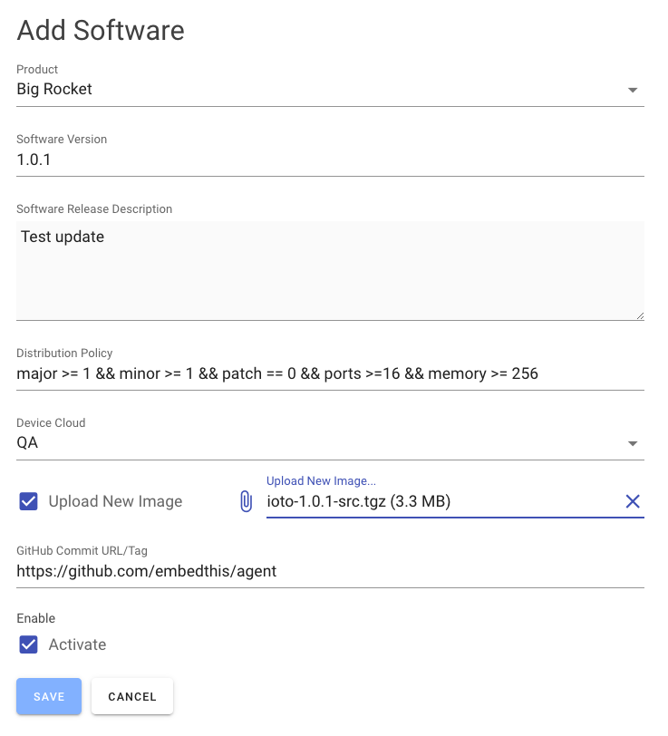

# Software Updates

It is highly desirable to be able to update and upgrade the software in your devices so you can deploy new features, patch security vulnerabilities and improve performance.

For Ioto devices, via the Builder, you can define software updates that will be managed and delivered Over-The-Air (OTA) to your devices.

Using the Builder OTA update manager, you can selectively deploy updates to any desired subset of your device population.

Updates can be published that will be applied to your devices according to a **distribution policy**. In this way, you can selectively update all your device or specific subsets as you require.

{.screen}

See [Builder Software Updates](https://www.embedthis.com/builder/doc/software/overview/) for details on how to configure software updates.

## Update Selection

Each day, the Ioto agent will connect to the device cloud for a "checkin". During this request, the agent will submit the **device.json** contents to the device cloud to see if an update is available for this device.

The device cloud will retrieve the most recent updates and check the updates in reverse version order and select the first matching update for the device.

The device cloud service will evaluate the distribution policy expression when the device checks-in and if the policy matches for the device, the URL for the update image will be returned to the Ioto agent. The agent will then fetch the update image and verify the integrity of the update image. If verified, the **scripts/update** script is invoked to apply the update. If you are running the Agent on an RTOS, without scripting, you will need to watch and react to the the event **device:update** using the rWatch API.

## Software Version

The current version for your device is defined via the **version** property in the config.json5 configuration file. NOTE: your device is versioned separately to the Ioto agent itself which has its own version string.

The version numbers must be compatible with the [SemVer 2.0](https://semver.org/) version specification.

## Device Cloud

Update images are stored in AWS S3 in your device cloud AWS account. When defining updates, you select the relevant device cloud to store and apply the updates. If you have multiple clouds, you will need to define updates in each cloud.

## Checking for Updates

The Ioto agent will issue a **checkin** HTTP request to the device cloud each day to query if there are any relevant updates for the device. This request submits the **device.json5** file and receives back a URL that refers to the update image.

If there is an applicable update, Ioto will download the image, verify the contents and then signal that an update is ready.

Your embedded code can watch for "device:update" events via the **rWatch** API. Alternatively, you can customize the **scripts/update** shell script that will be passed the local filename containing the update.
