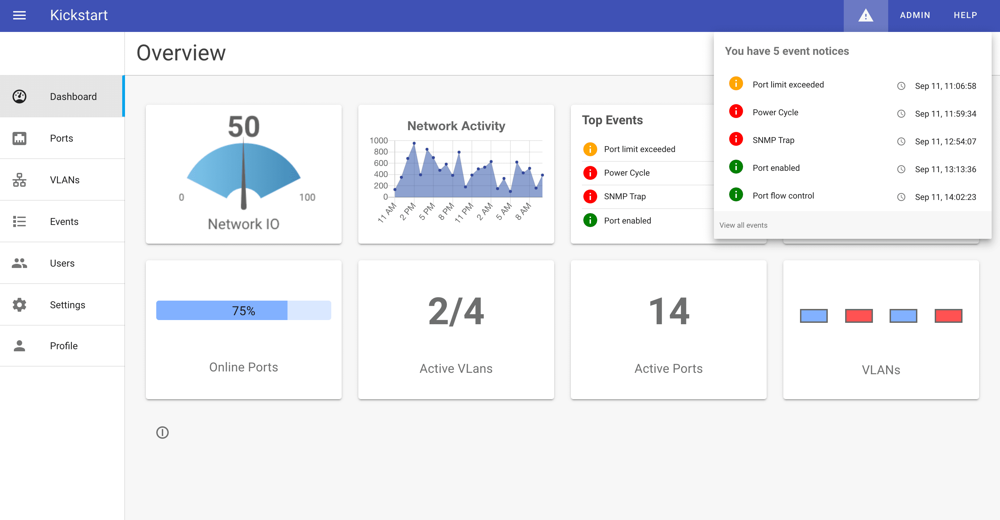

# Device Management

Ioto has a sample device manager called **KickStart** that can be downloaded via the Builder.

Kickstart is a fully working sample VueJS single-page application that you can use as a starting point for your device management applications.

The Kickstart app demonstrates the capabilities and experience provided by an application created with Ioto and VueJS.

It includes a local, embedded management app that runs within your device and serves a browser-based management user interface.

It also includes a skin for the Ioto Cloud Device Manager that communicated with the embedded Kickstart/Ioto agent, but enables management of one or more devices via the cloud.

{.screen}

## Cloud-Based Device Management

This skin approximates the functionality of the local Kickstart app, but allows management of multiple devices via the cloud.

The Kickstart app provides the manager cloud skin under the ./cloud/upload directory. It include a cloud device data schema (Schema.json), display definition (Display.json), logo and custom components (Components.js). These are available in the ./cloud/upload directory for upload to the Builder. Use the Builder Cloud / Edit panel and select **Update Manager UI** and upload each of these assets and save the device cloud configuration. This will recreate the Ioto Manager application.

For more details, consult the [Builder Device Manager Documentation]()

## Kickstart Specs

Read the [Kickstart Tech Specs](../specs/) for full details.

Kickstart Screens

See the [Kickstart Screen Images](../screenshots/) for a close up look.

## Kickstart Components

* User management
* User login
* Property edit
* Alert notification
* Event log
* Dashboard
* Dynamic tables and graphs
* Paged Data Tables
* Navigation
* Search
* Granular access control per page
* Help

## Licensing for Kickstart

Kickstart is free for Ioto customers.

Download from the Products page in [Embedthis Builder](https://admin.embedthis.com).

## Best Practices

Kickstart uses proven designs and best-practices to lower development risk. It includes most of the required elements for a secure web application, so you can eliminate months off your development schedule.
