# Kickstart Screen Shots

The following screenshots show some of the functionality of the Kickstart manager application.

## Home Screen

{.screen}

The Kickstart home screen with dashboard and pulldown notification event window.

## Widgets

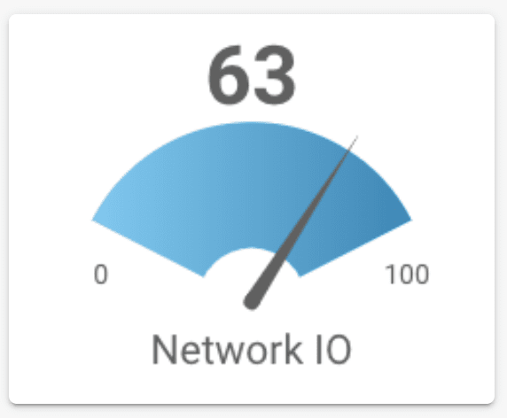{.screen}
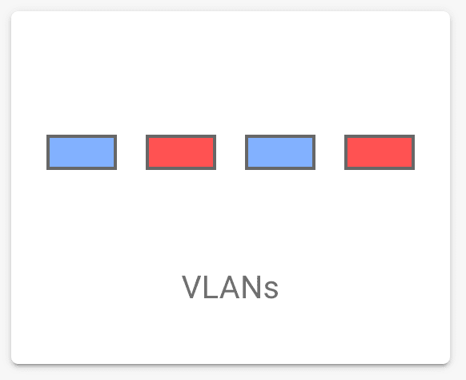{.screen}
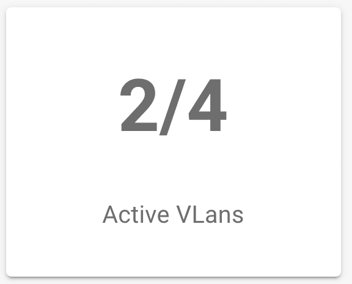{.screen}
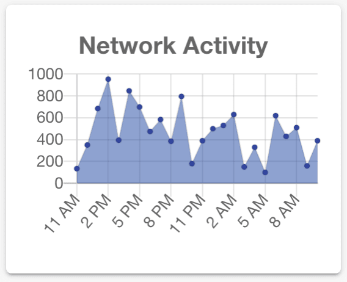{.screen}

The dashboard can use graphical widgets connected to a server-side data source. Data is pushed from the server over WebSockets. A gauge can define a min to max range and it uses animation to smooth transitions between data points.

## Graphs
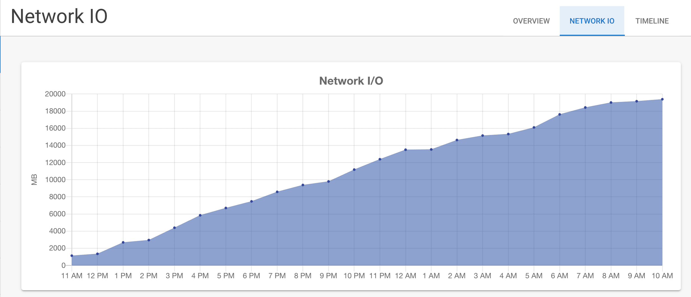{.screen}

Server data can be plugged into charts for graphical display. Ioto provides primitives to convert device data to JSON that can be easily connected to a suite of charts.

## Sidebar Navigation

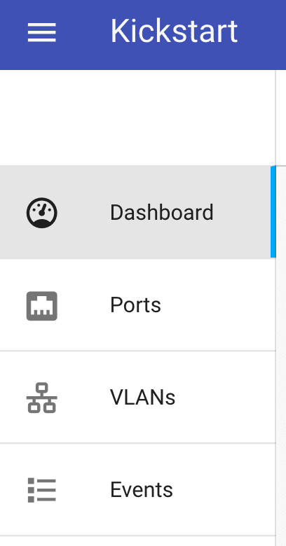{.screen}

Kickstart supports multi-level navigation. The current option is highlighted with show/hide indicators. Menus can be hidden if the authenticated user does not have the required permissions.

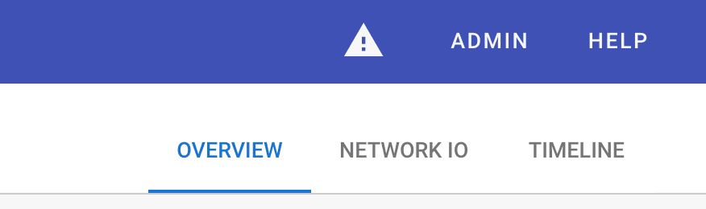{.screen}

## Events Screen

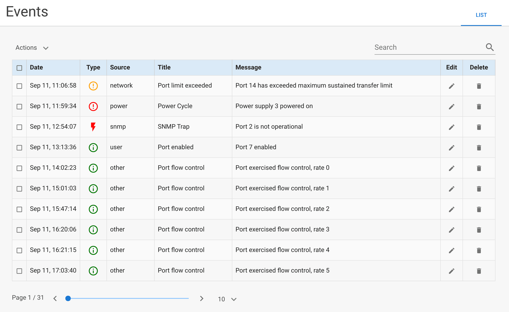{.screen}

The events log describes system events of interest according to severity. You can create events in the server for any custom condition.

## Feedback

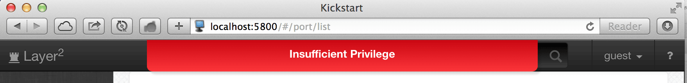{.screen}

Error messages and user feedback are transparently channeled to the browser and displayed with appropriate color coding. This may be customized by modifying the application theme stylesheet.

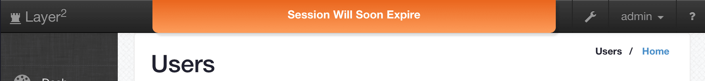{.screen}

## Login Screen

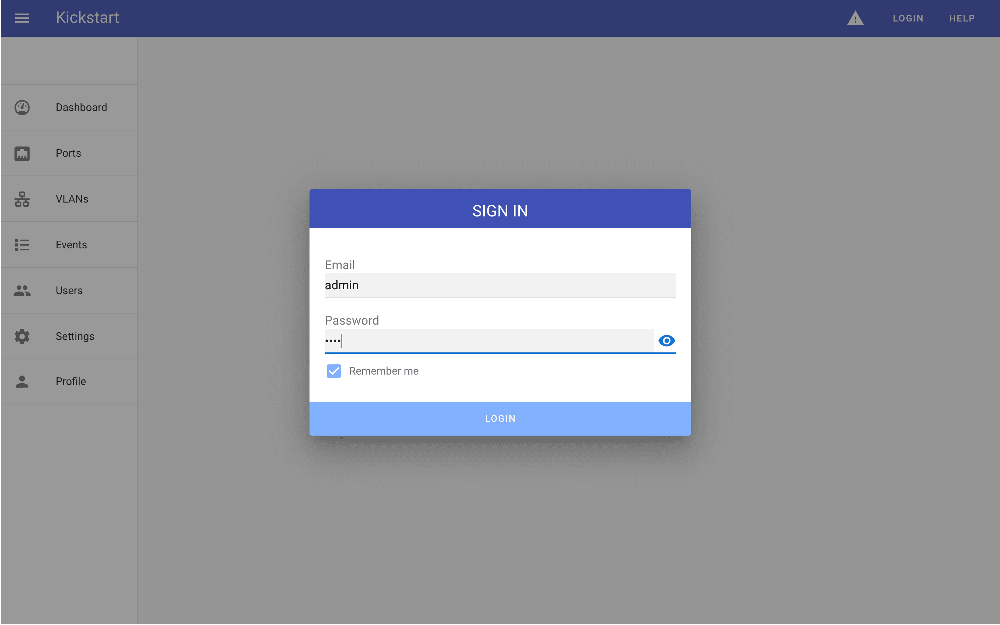{.screen}

Kickstart include a complete user login mechanism. Passwords are securely hashed using Blowfish encryption. Kickstart automatically ensures the login form and request are transported using SSL.
After login, users can be granted access to parts of the application dependent on their configured roles.

## Dialogs

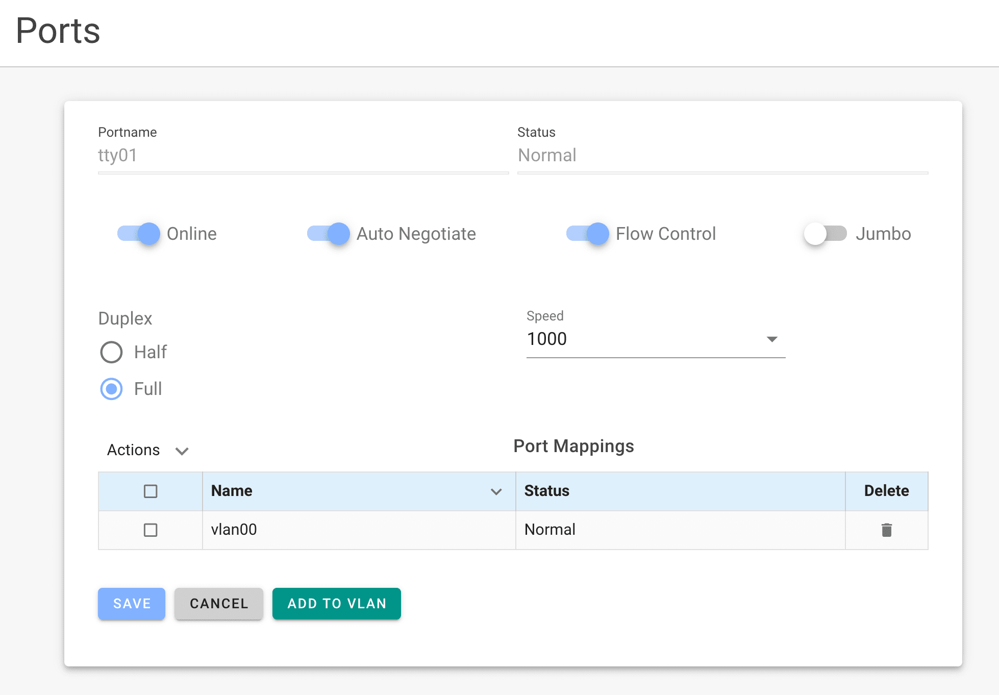{.screen}

Kickstart includes easy to use confirmation modal dialogs to confirm destructive actions.

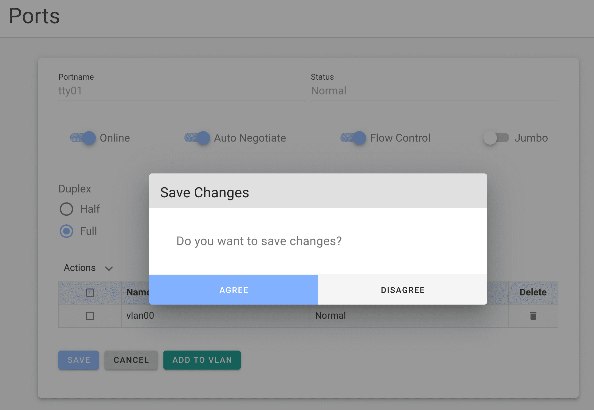{.screen}
