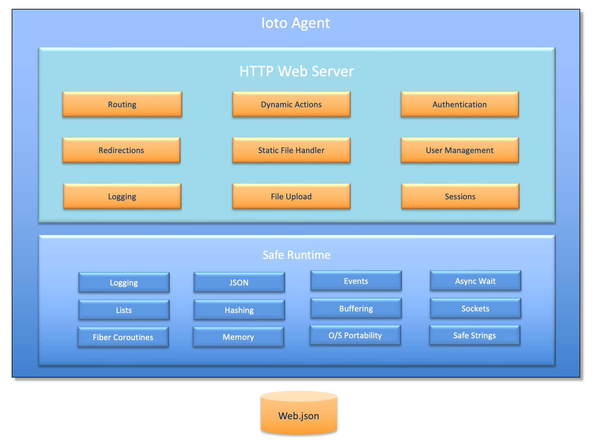

# Use Cases

The Ioto device agent can be utilized in a variety of use cases:

* [IoT Cloud Agent](#iot-cloud-agent)
* [HTTP Client](#http-client)
* [Local Device Management](#local-device-management)
* [Embedded Web Server](#embedded-web-server)
* [MQTT Client](#mqtt-client)

## IoT Cloud Agent

Device management from the cloud typically requires the MQTT protocol and an understanding of the MQTT topics supported by cloud provider.

The Ioto agent is pre-integrated with the AWS Cloud and is easily configured to enable MQTT communications with AWS IoT Core.

Ioto pre-integrates with a wide set of AWS services including: DynamoDB, IoT Core rules, IoT Shadows, S3, CloudWatch Logs, and CloudWatch metrics. Using IoT rules, you can also direct messages and data to many other AWS services.

The Ioto agent will:

- Send messages to AWS IoT and other services via MQTT.
- Upload data and files to AWS S3.
- Replicate and synchronize structured data to AWS DynamoDB.
- Send control-plane data to AWS IoT Shadows.
- Store Ioto, device and O/S logs in AWS CloudWatch logs.
- Create device and operational metrics in AWS CloudWatch Metrics.
- Save audit trails to AWS CloudTrail.

### Replicated Device Data

Ioto can replicate device data from its internal embedded device database to an AWS DynamoDB database in the cloud. This replication can operate in either direction so that data can be both aggregated from devices or sent to devices.

This replication is transparent and the device developer does not need create any custom code to facilitate. The replication is configurable and granular on a table-by-table basis, and is resilient in the event of network outages.

## HTTP Client

Ioto includes a streaming HTTP Client so you can make REST and HTTP requests to external web services.

The API provides a simple GET and POST routines and a powerful fully streaming fetch call.

As Ioto uses fiber coroutines, you can process streamed data (in either direction) without ugly callbacks or complex threads. Other fibers in Ioto continue to run transparently while the HTTP client is waiting for I/O.

Ioto uses the HTTP client to communicate with the Embedthis Builder site and various AWS services. Ioto includes AWS SigV4 signing APIs so you can issue any AWS API using the HTTP client without requiring the significant overhead of the full AWS SDK.

### Example
```c
//  Simple get
data = urlGet("https://www.example.com");

//  Simple post
data = urlPost("https://www.example.com", "POST", body, bodyLen,
    "Authorization: bearer %s\r\n", authToken);

//  Or fully streaming fetch
char  buf[1024];
ssize nbytes;
int   status;

status = urlFetch(up, "https://www.example.com", "POST", body, bodyLen, headers);
do {
    if ((nbytes = urlRead(up, buf, sizeof(buf))) > 0) {
        printf("%s", buf);
    }
} while (nbytes > 0);
```

## Local Device Management

Embedded web servers are useful for a variety of use cases including:

* Local end-user device setup and ongoing management.
* Provide a programatic REST API for device operation, data and metrics.
* Provide a debug web interface for developers creating connected devices.

## Embedded Web Server

The Ioto agent can be used as a stand-alone embedded web server without any cloud management features enabled.

Ioto can be configured and compiled to run only the web server and thus be a first-class replacement for any embedded web server. Embedthis has been developing embedded web servers for many years and the Ioto web server contains all that we have learned over this period.

>*Ioto is our best embedded web server with performance and security that surpasses other web servers.*

The Ioto web server is unlike other embedded web servers in that it does not try to offer *ALL* HTTP features and functions. Rather, it implements only the essential core of HTTP/1.1 and thus deliver a tiny, fast, secure embedded web server that is exceptionally good at serving single page web applications and device data APIs with a very small security footprint.

The Ioto web server supports: HTTP/1, HTTP/1.1, TLS/SSL, Action routines, user authentication, sessions, cookie management, request logging, and security sandboxing. Best of all, Ioto is tiny using only 80K of code. It will serve over 3,300 requests/sec on a Raspberry PI class of device.

The Ioto web server is fully streaming for receive and transmit data. It can receive live streaming data and dynamically generate responses based on device data.

### Example
```c
//  Bind a URL to a function to generate the response

webAddAction(host, "/test", testAction);

//  Invoked for /test requests
static int testAction(Web *web)
{
    char  buf[ME_BUFSIZE];
    ssize nbytes;
    int   i;

    //  Streaming read of POST body data
    while ((nbytes = webRead(web, buf, sizeof(buf))) > 0) {
        printf("Got body data %.*s\n", (int) nbytes, buf);
    }

    //  Streaming a response without buffering and with minimal memory footprint
    for (i = 0; i < 10000000; i++) {
        //  This will block as required, but other fibers can still run.
        webWriteFmt(web, "Hello World, now is: %s\n", rFormatLocalTime(0, 0));
    }
    //  Finalize
    webWrite(web, NULL, 0);
    return 0;
}
```



For more details, please read the [Ioto Web Server](../../web/overview/).

## MQTT Client

Most IoT cloud management services rely on the [MQTT](https://docs.oasis-open.org/mqtt/mqtt/v3.1.1/os/mqtt-v3.1.1-os.html) protocol.

MQTT is a light-weight client/server publish/subscribe messaging transport protocol. It is simple and has very low overhead and this makes it ideal for use in embedded devices and IoT where a small code footprint and minimal network overhead is required.

For a device to be managed by the cloud requires not only MQTT support, but also an understanding of what MQTT topics are required to integrate with the specific cloud provider.

Ioto has a high-performance, flexible MQTT client that can be used to communicate with any cloud service supporting MQTT 3.2.1.

The Ioto MQTT agent is non-blocking, but also supports a blocking mode where you can wait for a message to be acknowledged or receipt of a response. This enables the MQTT protocol to be used for request/response APIs. Because, Ioto uses fiber coroutines, even when an MQTT sequence of operations are blocking, other APIs and services continue to run in other fibers.

```c
PUBLIC int iaStart(void)
{
/*
    Subscribe for incoming notifications.
    This call will block and wait for acknowledgement.
    Note: call blocks, but agent is not.
 */
mqttSubscribe(agent->mqtt, incoming, MQTT_QOS_2, MQTT_WAIT_ACK, "/myDevice/change");

/*
    Publish an "initialized" message with quality of service (1) which means send at most once.
    Don't wait for sending or acknowledgement.
 */
mqttPublish(agent->mqtt, "Initialized", 0, MQTT_QOS_1, MQTT_WAIT_NONE, "/myDevice/init");
```
