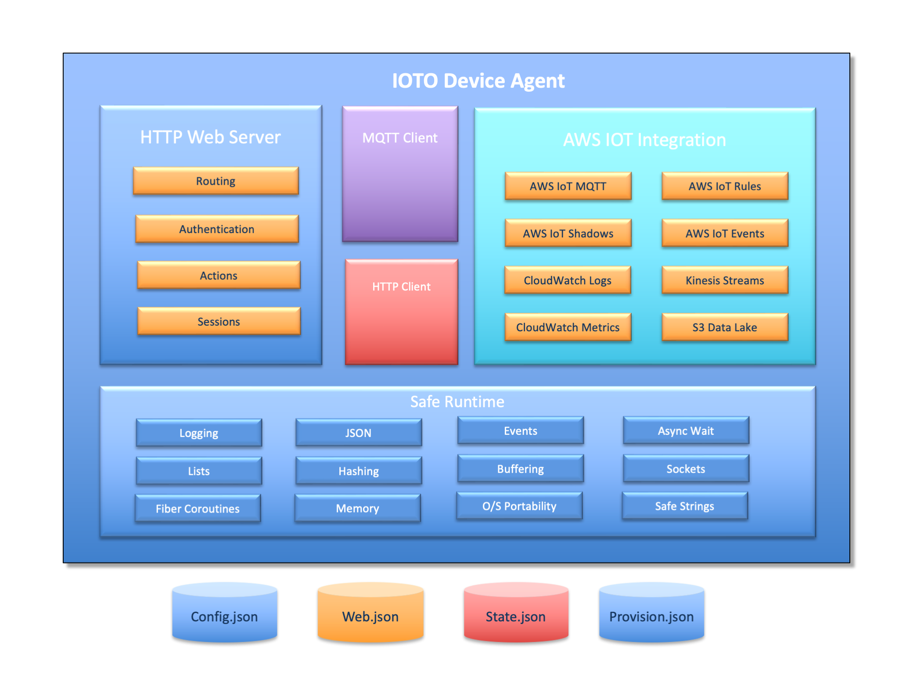

# Ioto Background

The Ioto device agent is a compact management agent and library. It provides AWS IoT cloud integration, HTTP web server, MQTT client, HTTP client, state persistency, provisioning and OTA upgrading.

Ioto is fast and compact, with a tiny memory footprint of less than 150K of code.

## Goals

Embedded agents for managing devices have several competing goals:

* Provide a strong and standard management feature set
* Minimize memory footprint
* Minimize CPU consumption
* Maximize security

To meet all these goals in one agent is difficult, but Ioto utilizes a safe runtime to assist. This maximizes code reuse and security, allowing management services to be coded as simply and efficiently as possible.

## Processing Architecture

Ioto is based on an event-driven, single-threaded fibre coroutine core. It uses a non-blocking, event-driven architecture and is capable of running many inbound and outbound requests simultaneously with minimal CPU and memory resources.

Ioto eliminates the ugliness of event callbacks and the complexity of threads by using fiber coroutines. A fiber coroutine is a segment of code that runs with its own stack and cooperatively yields to other fibers when it needs to wait. You can think of a fiber as a thread, but only one fiber runs at a time. For Go programmers, fibers are like Go routines. For JavaScript developers, fibers are similar to async/await.

Ioto fibers are baked into the I/O system so you can easily support parallelism by overlapping requests without any effort. You can read and write sockets, issue HTTP client requests, send MQTT messages or respond to web server requests using a straight-line procedural programming model.

All Ioto services are "fiber-enabled". This means that your user extension code is simple, easy to debug and maintainable over the long haul.

### Core Components

Ioto has a modular architecture where modules can be conditionally compiled as required to minimize your memory and security footprint.

The key components of Ioto are:

| Component | Description |
|-|-|
| Embedded Web Server | Embedded web server supporting HTTP/1.1, TLS 1.3, C action functions, file upload, transfer-encoding, user management, sessions and cookies, authentication, sandbox limits. |
| Embedded Database | Embedded NoSQL database with JSON documents, red/black indexing, local persistency, triggers and replication to the cloud. |
| MQTT 3.1.1 Client | Supports publish, subscribe, ping and disconnect messages. Includes retained message support and connect over port 443 via ALPN. |
| AWS Iot Integration | AWS Iot cloud ready with data export to IoT shadows, S3, CloudWatch logs, CloudWatch metrics, Kinesis for streaming and DynamoDB for structured device data. |
| Transport Layer Security (TLS/SSL) | Secure Socket Layer protocol stack. This is a virtual interface that can selectively support a variety of TLS providers including: the MbedTLS and OpenSSL stacks. |
| JSON | JSON and JSON 5/6 parser. This module includes JSON persistency to files and a powerful JSON query engine. |
| Safe Portable Runtime | Cross-platform safe portable runtime. Includes services for memory allocation, buffer management, safe string handling, lists, hashing, sockets, events, timers, logging and fiber coroutines. |

## Integration Models

Ioto can be integrated into your system in two ways:

* Use the Ioto main() and provide your "start" and "stop" functions.
* Use your own main() and link with the Ioto library.

### Use the Ioto Main

The first way to integrate Ioto is to use the Ioto main program and provide your own start and stop functions. In this manner, your app becomes empowered with MQTT, HTTP and AWS integration services.

Ioto can be customized by providing your own **iaStart** and **iaStop** functions that are invoked by Ioto during startup and shutdown.

### Provide your own main()

The second way to integrate Ioto is to create your own main program and link with the Ioto library. This method is desirable if you have more extensive customizations or need to parse custom command line options.

See [Embedding Ioto](../../dev/embedding/) for more details.

## Ioto Configuration

Ioto uses a set of JSON configuration files to control execution. These configuration files are read when Ioto starts.

The configuration files use a relaxed JSON format called JSON/5. This format is similar to the JavaScript object literal notation. Specifically, it supports: comments, keys without quotes, trailing commas and multiline strings.

The configuration files are:

|File|Description|
|-|-|
| auth.json5 | Authentication configuration for the web server. Includes defined roles, users and passwords.|
| config.json5 | Primary Ioto configuration file. Configures enabled services, logging and log file ingestion |
| device.json5 | Device registration configuration. |
| provision.json5 | Cloud provisioning endpoints and keys. |
| shadow.json5 | Local copy of the AWS IoT shadow state. |
| web.json5 | Web server configuration file. |

See [Ioto Configuration](../configuration/) for more details.

## Ioto HTTP Web Server

The Ioto web server is a fast, compact web server designed for management web applications and serving device data.

Management applications are best created using [Single Page Application](https://en.wikipedia.org/wiki/Single-page_application) design techniques where the application is rendered locally in the browser and it requests pure-data from the device to populate dynamic content.

Ioto is ideal for this approach. It includes an integrated embedded database, JSON parser and query engine to enable it to respond to HTTP requests with JSON payloads and remit responses in JSON.

Ioto does not provide a web framework &mdash; nor do we believe that dynamically generating HTML is the most compact, secure or best approach for performing device management.

Ioto includes a fully working sample single page application called Kickstart. This is a VueJS application that serves a sample device application for Ioto.

The core web services include:

* HTTP/1.1 protocol engine.
* Non-blocking socket communications.
* TLS (SSL) 1.3 support.
* Multiple listen endpoints.
* Flexible configuration via the web.json file.
* Session and cookie management.
* Authentication and User management.
* Serve static files.
* File upload.
* Transfer chunk encoding in both directions.
* Fully streaming receive and transmit data.
* Binding URLs to C functions for dynamic content rendering.

The Ioto web server is exceptionally fast and will serve over 3K requests per second on a modest Raspberry PI 4 and yet runs using only 80K of code.

## Agent Security</h2>

Ioto provides a suite of measures designed to increase the security of the Ioto device agent:

* TLS &mdash; Secure Sockets Layer
* Sandbox limits directives
* Authorization directives
* Safe, secure portable runtime
* Simple fiber coroutine programming paradigm

Ioto supports the MbedTLS and OpenSSL stacks. You can configure server and/or client certificate-based authentication.

## Safe Portable Runtime (R)

Ioto is built upon a portable runtime layer called the Safe Portable Runtime or "runtime" for short. This layer insulates the rest of the product from the underlying platform and allows it to be highly portable to new operating systems or hardware.

The runtime provides a suite of services that facilitate the creation of high performance management applications, including: buffer management, networking, safe string handling, events, wait management, logging, lists and hashing.

The runtime permits the rest of the Ioto code to be more secure by using the safe primitives offered by the runtime. It includes many mechanisms to assist in the creation of secure applications. One such facility is a safe string and buffer handling module to help eliminate the buffer overflows that have plagued many products.
